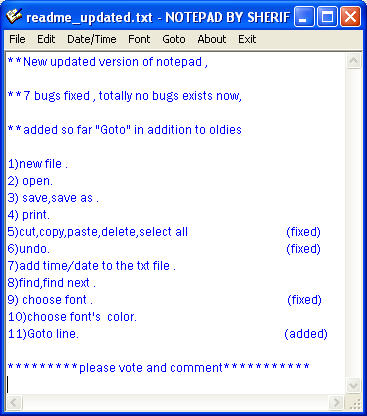



## notepad \(second version\)

### Description

**New updated version of notepad ,

**7 bugs fixed , totally no bugs exists now,

**added so far "Goto" in addition to oldies

1)new file .

2) open.

3) save,save as .

4) print.

5)cut,copy,paste,delete,select all 		(fixed)

6)undo.					(fixed)

7)add time/date to the txt file .

8)find,find next .

9) choose font .    			          (fixed)

10)choose font's color.

11)Goto line.   			         (added)

----

please vote and comment

----

 
### More Info
 

             |
---                |---
**Submitted On**   |2002-09-09 13:26:30
**By**             |[sherif rofael](https://github.com/Planet-Source-Code/PSCIndex/blob/master/ByAuthor/sherif-rofael.md)
**Level**          |Beginner
**User Rating**    |4.1 (37 globes from 9 users)
**Compatibility**  |VB 3\.0, VB 4\.0 \(16\-bit\), VB 4\.0 \(32\-bit\), VB 5\.0, VB 6\.0
**Category**       |[Libraries](https://github.com/Planet-Source-Code/PSCIndex/blob/master/ByCategory/libraries__1-49.md)
**World**          |[Visual Basic](https://github.com/Planet-Source-Code/PSCIndex/blob/master/ByWorld/visual-basic.md)
**Archive File**   |[notepad\_\(s1303739122002\.zip](https://github.com/Planet-Source-Code/sherif-rofael-notepad-second-version__1-38933/archive/master.zip)

